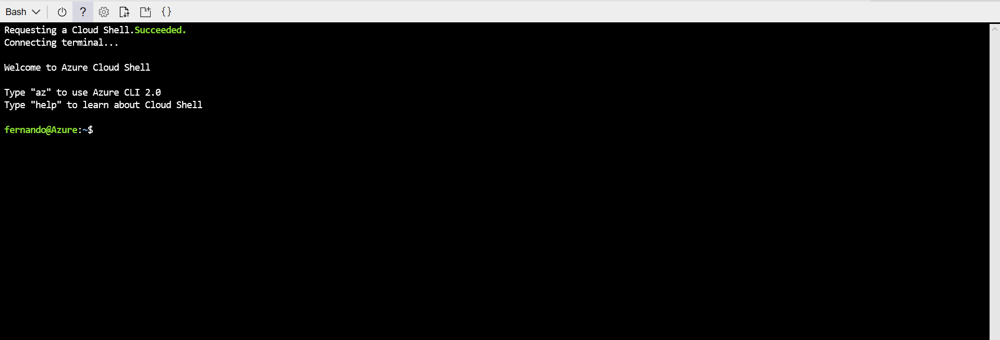

#   Heroes APP (Vue js, Express, MongoDb) on Ubuntu VM

En este tutorial desplegaremos la aplicación de Heroes app en una vm dentro de azure.

## Pre-requisitos ##

*	Instalar [git](https://git-scm.com/downloads)
*	Instalar [nodejs](https://nodejs.org/es/download/)
*	Instalar [Visual Studio Code](https://code.visualstudio.com/download)
*	Si no tienes suscripción de Azure, Activar [Visual Studio Dev Essentials](https://www.visualstudio.com/es/dev-essentials/)
*	Activar suscripción de 25 USD mensuales de Azure durante 12 meses


##  Creación de Vm ubuntu

*   Primero accedemos a la [consola web de azure](http://shell.azure.com/)



*   Luego procedemos a definir algunas variables que usaremos
```bash 
    RG_NAME=iaasHeroesApp  
    VM_NAME=HeroesAppUbuntuVm
    REGION=eastus
```

*   Luego procedemos a crear un grupo de recursos
```bash 
az group create --name $RG_NAME --location $REGION
```

*   Una vez creado el grupo de recurso, creamos una vm ubuntu
```bash
# Creamos una nueva maquina virtual, esto creara llaves SSH si no estan presentes
az vm create --resource-group $RG_NAME --name $VM_NAME --image UbuntuLTS --generate-ssh-keys

# Abrimos el puerto 8080 para permitir trafico web.
az vm open-port --port 8080 --resource-group $RG_NAME --name $VM_NAME

# Abrimos el puerto 8080 para permitir trafico web.
az vm open-port --port 3000 --resource-group $RG_NAME --name $VM_NAME

# Usamos la extension CustomScript para instalar nodejs, npm, mongodb y docker
az vm extension set \
  --publisher Microsoft.Azure.Extensions \
  --version 2.0 \
  --name CustomScript \
  --vm-name $VM_NAME\
  --resource-group $RG_NAME \
  --settings '{"commandToExecute":"apt-get -y update && apt-get -y install nodejs && apt-get -y install npm && ln -s /usr/bin/nodejs /usr/local/bin/node && apt-get -y install mongodb && apt-get -y install docker.io"}'
```

*   Una vez creada la vm, buscamos la dirección de la IP pública y nos conectamos vía ssh
```bash 
ssh <TU_DIRECCIÓN_IP_PUBLICA>
```

## Corremos Mongodb

*   Antes de iniciar mongodb le cambiaremos el puerto a 27019 para ello ejecutamos el siguiente comando

```bash 
##Cambiamos el puerto en el archivo de configuracion de mongodb
sudo sed -i -- 's/#port = 27017/port = 27019/g' /etc/mongodb.conf

##Reiniciamos el servicio de Mongodb
sudo service mongodb restart
```
*   Clonamos los datos de la aplicación y la aplicación
```bash 
git clone https://github.com/feranto/blackbelt-aks-hackfest.git
```

*   Cargamos la data en mongodb
```bash 
cd ~/blackbelt-aks-hackfest/app/db

mongoimport --host localhost:27019 --db webratings --collection heroes --file ./heroes.json --jsonArray && mongoimport --host localhost:27019 --db webratings --collection ratings --file ./ratings.json --jsonArray && mongoimport --host localhost:27019 --db webratings --collection sites --file ./sites.json --jsonArray
```

## Corremos la Api en Express JS

La API para la aplicación está escrita en javascript, corriendo en [Node.js](https://nodejs.org/en/ "Node.js Homepage") y [Express](http://expressjs.com/ "Express Homepage")

1. Primero actualizamos las dependencias y corremos la app utilizando node dentro de la vm

    ```bash
    cd ~/blackbelt-aks-hackfest/app/api

    npm install && npm run localmachine
    ```

2. Podemos abrir una nueva terminal a la vm y probar la api localmente usando curl

    ```bash
    curl http://localhost:3000/api/heroes
    ```
    

## Aplicación web - Vue.js, Node.js

El frontend de la aplicación está escrita en [Vue.js](https://vuejs.org/Vue "Vue.js Homepage"), corriendo en [Node.js](https://nodejs.org/en/ "Node.js Homepage") con [Webpack](https://webpack.js.org/ "Webpack Homepage")

1. Abrimos una nueva terminal a la vm
2. Actualizamos las dependencias utilizando npm

    ```bash
    cd ~/blackbelt-aks-hackfest/app/web

    npm install && npm run localmachine
    ```
3. Probamos el frontend

    La vm deberia tener abierto el puerto 8080. Deberiamos poder navegar al siguiente link: <IP_PUBLICA_VM>:8080 

    Tambien lo podemos probar localmente desde la terminal utilizando curl:
    ```bash
    curl http://localhost:8080
    ```


## Administrar docker como usuario no-root
*   Una vez dentro de la vm, ejecutamos los siguientes scripts para poder ejecutar docker más facilmente
*   Creación grupo docker
```bash 
sudo groupadd docker
```
*   Agregamos nuestro usuario al grupo
```bash 
sudo usermod -aG docker $USER
```
*   Hacemos log out y volvemos a loguearnos
```bash 
exit
```
```bash 
ssh <PUBLIC_IP_ADDRESS>
```

*   Verificamos que podamos correr docker sin usuario root
```bash 
docker run hello-world
```
