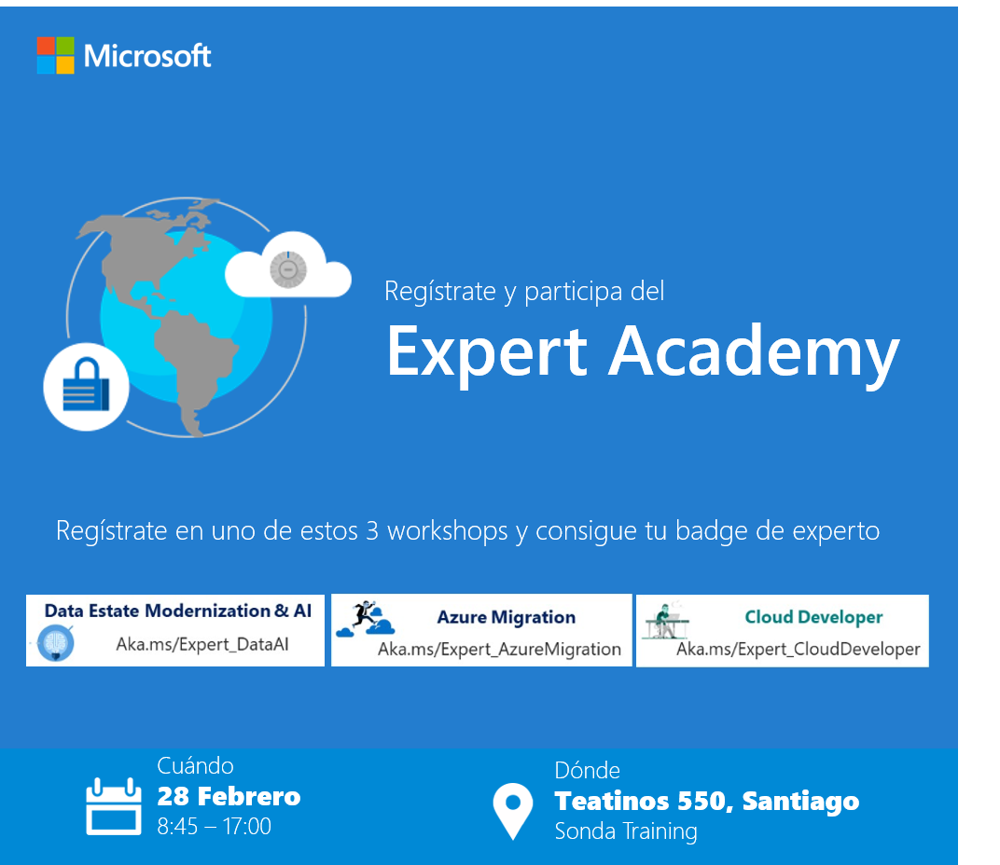

# Expert Academy Santiago 2019 CosmosDB!

  

## Taller de CosmosDB

Bienvenidos al taller introductorio para CosmosDB

En este taller aprenderemos los siguientes conceptos:
     
## Laboratorio Práctico
*   [Creando una base de datos CosmosDB](https://github.com/feranto/azureDemos/tree/master/Database/CosmosDB/ExpertAcademyLabJan19/labs/lab_01)
*   [Manipulando datos utilizando el Portal de Azure](https://github.com/feranto/azureDemos/tree/master/Database/CosmosDB/ExpertAcademyLabJan19/labs/lab_02)
*   [Accediendo los datos con diferentes API's (Mongo y SQL)](https://github.com/feranto/azureDemos/tree/master/Database/CosmosDB/ExpertAcademyLabJan19/labs/lab_03)
*   [Ingestando data en CosmosDB desde Data Factory](https://github.com/feranto/azureDemos/tree/master/Database/CosmosDB/ExpertAcademyLabJan19/labs/lab_04)
*   [Conectando una app a CosmosDB](https://github.com/feranto/azureDemos/tree/master/Database/CosmosDB/ExpertAcademyLabJan19/labs/lab_05)