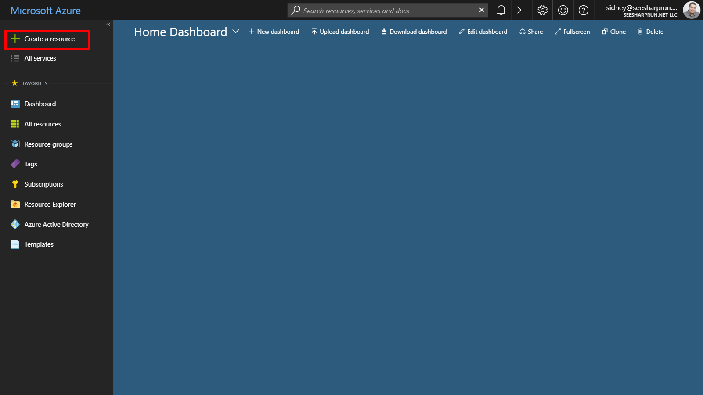
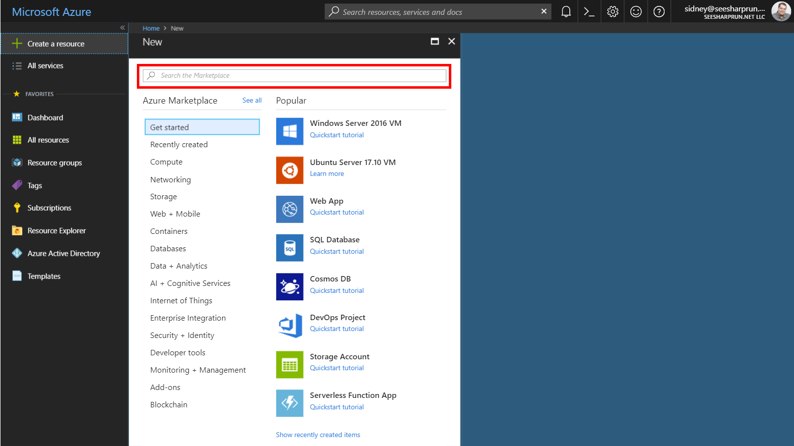
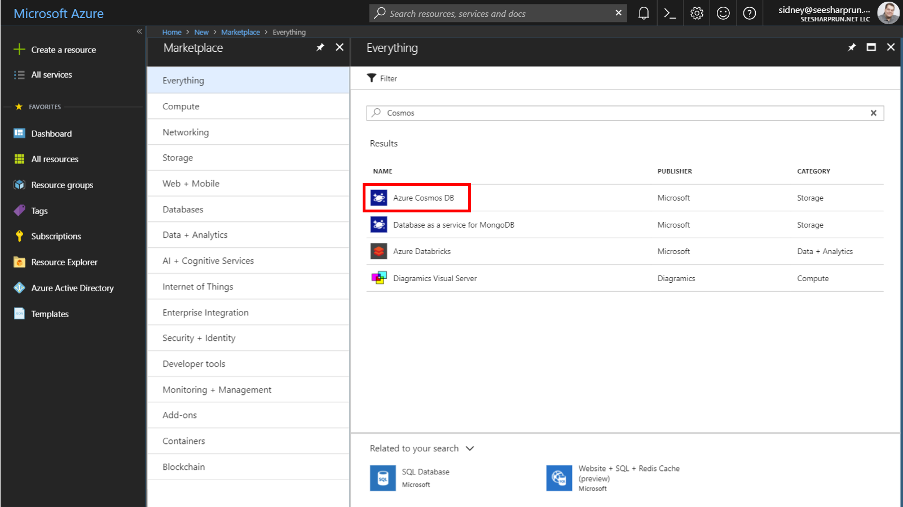
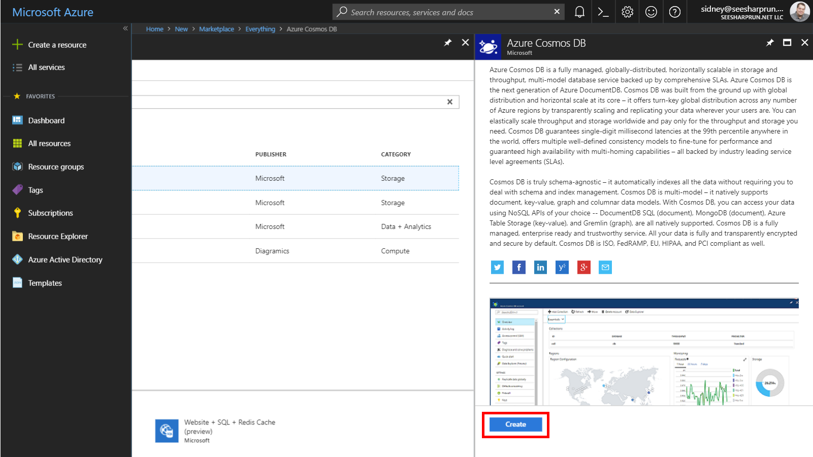
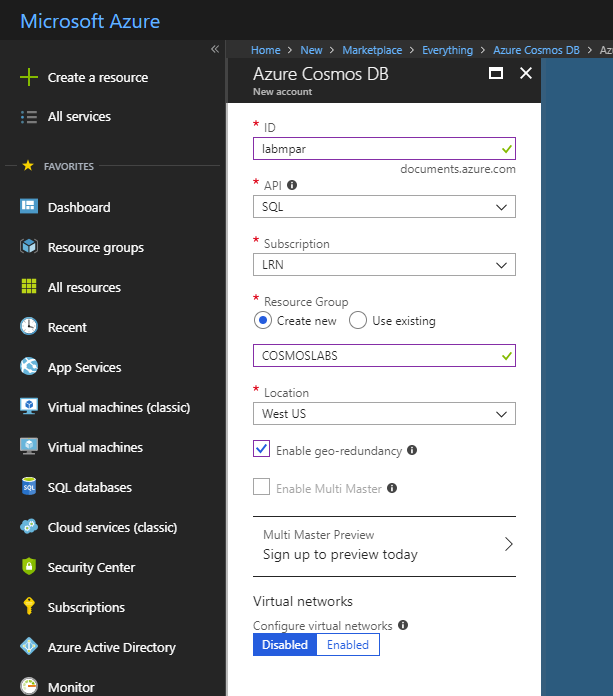

# Lab 1 - Setting Up Cosmos DB

This lab outlines how to deploy Azure Cosmos DB with the Azure Web Portal UI and with the Azure crossplatform command line interface (CLI) for MacOS, Linux and Windows.  We will take a look at key considerations before any full/production deployment of Cosmos DB to ensure all dependent/required features of Cosmos are activated based on your applications needs for DB API/Model(s), Scale, Availablity, Replication, Consistency, Latency etc.

While some features you can tune after a Cosmos DB instance is deployed, it is always best to methodically consider what you will need/want before deploying any managed service for production use.

# Getting Started

In this lab, you will create an Azure Cosmos DB account, database, and multiple collections. You will then populate the collections with sample data that will be used in various labs.

### Create Azure Cosmos DB Assets

*You will now create an Azure Cosmos DB account to use in the remaining labs.*

1. In a new window, sign in to the **Azure Portal** (<http://portal.azure.com>).

1. On the left side of the portal, click the **Create a resource** link.

    

1. At the top of the **New** blade, locate the **Search the Marketplace** field.

    

1. Enter the text **Cosmos** into the search field and press **Enter**.

1. In the **Everything** search results blade, select the **Azure Cosmos DB** result.

    

1. In the **Azure Cosmos DB** blade, click the **Create** button.

    

1. In the new **Azure Cosmos DB** blade, perform the following actions:

    1. In the **ID** field, enter a globally unique value e.g. yourname-cosmoslab.

    1. In the **API** list, select the **SQL** option.

    1. Leave the **Subscription** field set to its default value.

    1. In the **Resource group** section, select the **Create new** option.

    1. In the **Resource group** section, enter the value **COSMOSLAB**  into the empty field.
        1. Note we will be deploying all resources/services in today's lab using this resource group.

    1. In the **Location** field, select the **EAST US 2** location.

    1. Ensure the **Enable geo-redundancy** option is selected.

        > This option creates a replicated version of your database in a second (paired) region.

    1. Ensure the **Enable Multi Master** option is __not__ selected.

        > With Azure Cosmos DB multi-master support, you can perform writes on containers of data (for example, collections, graphs, tables) distributed anywhere in the world. You can update data in any region that is associated with your database account. These data updates can propagate asynchronously. 

    1. In the **Virtual networks** section, select the **Disabled** option.

        > Azure CosmosDB accounts can be configured to allow access only from specific subnet of an Azure Virtual Network. By enabling a Service Endpoint for Azure CosmosDB from a Virtual Network and its subnet, traffic is ensured an optimal and secure route to the Azure Cosmos DB.

    1. Click the **Create** button.

    

1. Wait for the creation task to complete before completing this lab.