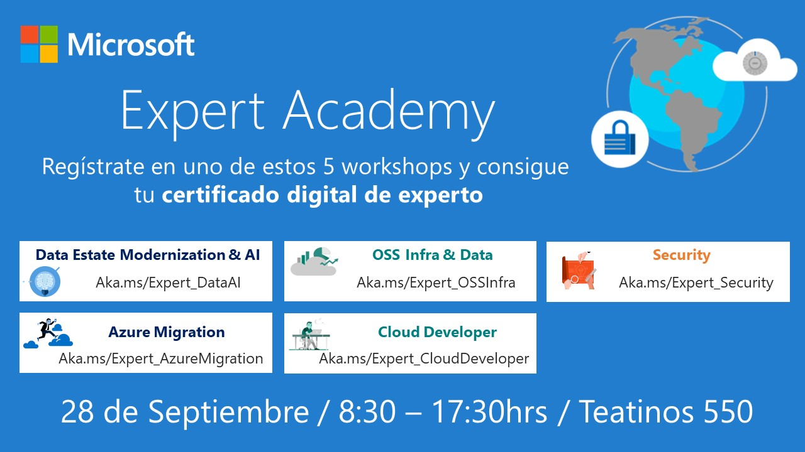

# Expert Academy Santiago 2018!

  

## Taller Introducción a Contenedores y Docker

Bienvenidos al taller introductorio para contenedores docker del Expert Academy 2018 de Microsoft.

En este taller aprenderemos los siguientes conceptos:

*   Cloud Native Applications
*   Contenedores, virtualización de S.O.
*   Conceptos Docker
    *   DockerFiles
    *   Imagenes
    *   Contenedores
    *   Networking
*   Registros de Contenedores

## Laboratorio Práctico
*   [Parte 1: Aplicación Heroes MEAN](https://feranto.github.io/azureDemos/CloudComputing/IAAS-Heroes-App/)
    *   [Formato Alternativo Parte 1: Aplicación Heroes MEAN](https://github.com/feranto/azureDemos/tree/master/CloudComputing/IAAS-Heroes-App)
*   [Parte 2: Llevando nuestra aplicación a contenedores Docker](https://feranto.github.io/azureDemos/OpenDevFrameworks/Docker/Docker-Heroes-App/)
    *   [Formato Alternativo Parte 2: Llevando nuestra aplicación a contenedores Docker](https://github.com/feranto/azureDemos/tree/master/OpenDevFrameworks/Docker/Docker-Heroes-App)
*   [Parte 3: Guardando y Construyendo nuestras imagenes en la nube](https://github.com/Azure/blackbelt-aks-hackfest/blob/master/labs/day1-labs/02-dockerize-apps(alt-acr-build).md)
    *   [(Alternativo)Parte 3: Guardando y Construyendo nuestras imagenes en la nube](https://github.com/Azure/blackbelt-aks-hackfest/blob/master/labs/day1-labs/02-dockerize-apps.md)