<a name="HOLTitle"></a>
# Docker Orchestration and the Azure Container Service #

<a name="Overview"></a>
## Overview ##

Since its inception, Docker has been has been delivering solutions to support and enable DevOps. [DevOps](https://en.wikipedia.org/wiki/DevOps) is a set of tools and practices for automating software development processes. Docker earned lots of attention due to how quickly and easily and software could be deployed and scaled with it, and it has since revolutionized the way that many organizations develop and deliver software. 

Docker's primary contribution to DevOps is [containers](https://www.docker.com/what-container). Containers allow apps and all of their dependencies, including run-times, libraries, and file systems, to be wrapped up in a single package. Containers provide isolation and abstraction much like virtual machines (VMs) do, but since they don't virtualize hardware, containers tend to be much smaller and start much faster. In addition, they place less demand on system resources such as RAM since an entire operating-system image doesn't have to be loaded into each container.

The process of getting containers into production and managing them while they are there is called [orchestration](https://www.docker.com/cp/container-orchestration-engines). Containers are designed to be deployed en masse with the possibility of thousands of container instances running on a single machine or cluster of machines. Several container-orchestration tools are available in the open-source community, including [Docker Swarm](https://docs.docker.com/engine/swarm/), [Apache DC/OS](https://dcos.io/), and [Google Kubernetes](https://kubernetes.io/). Orchestration tools such as these typically deploy containers to a cluster of physical or virtual machines. One or more of these machines acts as a *master node* that controls the orchestration by deploying containers to agent nodes. The other nodes in the cluster are *agent nodes*, which host the containers themselves.


Microsoft's [Azure Container Service (ACS)](https://azure.microsoft.com/en-us/services/container-service/) provides preconfigured, production-ready clusters using DC/OS, Kubernetes, or Swarm for orchestration. ACS is a first class citizen on Azure, meaning that it can be deployed and managed through a number of different channels including the Azure CLI, Azure APIs and the Azure Portal. Agent clusters are built on [VM Scale Sets](https://docs.microsoft.com/en-us/azure/virtual-machine-scale-sets/virtual-machine-scale-sets-overview) so they can be scaled up or down as needed without having to rebuild the cluster.

In this lab, you will deploy three separate container services using the Azure Container Service and designate a different orchestrator for each. Then you will run one or more container instances in each container service using a container image you pushed to Docker Hub. Along the way, you will get first-hand experience dealing with Swarm, DC/OS, and Kubernetes, and see what's involved in using them with Azure.

<a name="Objectives"></a>
### Objectives ###

In this hands-on lab, you will learn how to:

- Create an Azure Container Service
- Tunnel in to an Azure Container Service using SSH
- Create Docker images and push them to Docker Hub
- Orchestrate container deployments using Swarm, DC/OS, and Kubernetes
- Run Docker containers in Azure

<a name="Prerequisites"></a>
### Prerequisites ###

The following are required to complete this hands-on lab:

- An active Microsoft Azure subscription. If you don't have one, [sign up for a free trial](http://aka.ms/WATK-FreeTrial).
- A [Docker Hub account](https://hub.docker.com/)
- [PuTTY](http://www.chiark.greenend.org.uk/~sgtatham/putty/download.html) (Windows users only)
- Docker client (also known as the *Docker Engine CLI*) for [Windows](https://get.docker.com/builds/Windows/x86_64/docker-latest.zip), [macOS](https://get.docker.com/builds/Darwin/x86_64/docker-latest.tgz), or [Linux](https://get.docker.com/builds/Linux/x86_64/docker-latest.tgz)

To install the Docker client for Windows, open https://get.docker.com/builds/Windows/x86_64/docker-latest.zip and copy the executable file named "docker.exe" from the "docker" subdirectory to a local folder. To install the Docker client for macOS, open https://get.docker.com/builds/Darwin/x86_64/docker-latest.tgz and copy the executable file named "docker" from the "docker" subdirectory to a local folder. To install the Docker client for Linux, open https://get.docker.com/builds/Linux/x86_64/docker-latest.tgz and copy the executable file named "docker" from the "docker" subdirectory to a local folder. (You can ignore the other files in the "docker" subdirectory.)

> After installing the Docker client, add the directory in which it was installed to the PATH environment variable so you can execute **docker** commands on the command line without prefacing them with path names.

You do not need to install the Docker client if you already have Docker (or Docker Toolbox) installed on your machine.

<a name="Exercises"></a>
## Exercises ##

This hands-on lab includes the following exercises:

- [Exercise 1: Create an SSH key pair](#Exercise1)
- [Exercise 2: Create a container service](#Exercise2)
- [Exercise 3: Record fully qualified domain names](#Exercise3)
- [Exercise 4: Connect to the master node](#Exercise4)
- [Exercise 5: Create a Docker image, push it to Docker Hub, and run it in a container](#Exercise5)
- [Exercise 6: Delete the resource group](#Exercise6)
- [Exercise 7: Orchestrate with DC/OS](#Exercise7)
- [Exercise 8: Orchestrate with Kubernetes](#Exercise8)

Estimated time to complete this lab: **75** minutes.

<a name="Exercise1"></a>
## Exercise 1: Create an SSH key pair ##

Before you can deploy Docker images to Azure, you must create an Azure Container Service. And in order to create an Azure Container Service, you need a public/private key pair for authenticating with that service over SSH. In this exercise, you will create an SSH key pair. If you are using macOS or Linux, you will create the key pair with ssh-keygen. If you are running Windows instead, you will use a third-party tool named PuTTYGen.

> Unlike macOS and Linux, Windows doesn't have an SSH key generator built in. PuTTYGen is a free key generator that is popular in the Windows community. It is part of an open-source toolset called [PuTTY](http://www.putty.org/), which provides the SSH support that Windows lacks.

1. **If you are running Windows, skip to Step 6**. Otherwise, proceed to Step 2.

1. On your Mac or Linux machine, launch a terminal window.

1. Execute the following command in the terminal window:

	<pre>ssh-keygen</pre>

	Press **Enter** three times to accept the default output file name and create a key pair without a passphrase. The output will look something like this: 

 	

	_Generating a public/private key pair_

1. Use the following commands to navigate to the hidden ".ssh" subdirectory created by ssh-keygen and list the contents of that subdirectory:

	```	
	cd ~/.ssh
	ls
	```

	Confirm that the ".ssh" subdirectory contains a pair of files named **id_rsa** and **id_rsa.pub**. The former contains the private key, and the latter contains the public key.

1. Leave the terminal window open and **proceed to [Exercise 2](#Exercise2). The remaining steps in this exercise are for Windows users only**.

1. Launch PuTTYGen and click the **Generate** button. For the next few seconds, move your cursor around in the empty space in the "Key" box to help randomize the keys that are generated.

 	

	_Generating a public/private key pair_

1. Once the keys are generated, click **Save public key** and save the public key to a text file named **public.txt**. Then click **Save private key** and save the private key to a file named **private.ppk**. When prompted to confirm that you want to save the private key without a passphrase, click **Yes**.

 	

	_Saving the public and private keys_

You now have a pair of files containing a public key and a private key. Remember where these files are located, because you will need them in subsequent exercises.

<a name="Exercise2"></a>
## Exercise 2: Create a container service ##

Now that you have an SSH key pair, you can deploy an Azure Container Service. In this exercise, you will use the Azure Portal to create a container service for running Docker containers, and you will configure the service to use Docker Swarm. Swarm is a native Docker technology that creates a cluster of Docker Engine nodes allowing container workloads to be spread across multiple nodes in a cluster.

1. Open the [Azure Portal](https://portal.azure.com) in your browser. If you are asked to log in, do so using your Microsoft account.

1. Click **+ New**, followed by **Containers** and **Azure Container Service**.

	

	_Creating a container service_

1. Click the **Create** button at the bottom of the "Azure Container Service" blade. In the "Basics" blade, select **Swarm** as the orchestrator. Select **Create new** under **Resource group** and enter the resource-group name "OrchestrationLabResourceGroup" (without quotation marks). Select the location nearest you under **Location**, and then click the **OK** button.

	> Swarm, DC/OS, and Kubernetes are popular open-source orchestration tools that enable you to deploy clusters containing thousands or even tens of thousands of containers. (Think of a compute cluster consisting of containers rather than physical servers, all sharing a load and running code in parallel.)  All three are preinstalled in Azure Container Service, with the goal being that you can use the one you are most familiar with rather than learn a new tool. Swarm is Docker's own native clustering tool.

	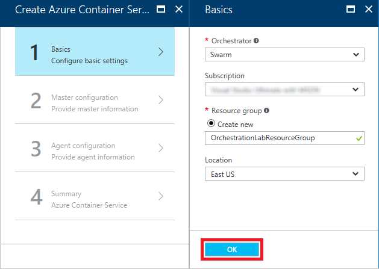

	_Basic settings_

1. In the "Master configuration" blade, enter a DNS name prefix in the **DNS name prefix** box. (The prefix doesn't have to be unique across Azure, but it does have to be unique to a data center. To ensure uniqueness, you should *include birth dates or other personal information* that is unlikely to be used by other people working these exercises. Otherwise, you may see a green check mark in the **DNS name prefix** box but still suffer a deployment failure.) Enter "dockeruser" (without quotation marks) for **User name** and the public key that you generated in [Exercise 1](#Exercise1) for **SSH public key**. Then set **Master count** to **1** and click **OK**.

	> You can retrieve the public key from the **id_rsa.pub** or **public.txt** file that you generated in Exercise 1 and paste it into **SSH public key** box.

	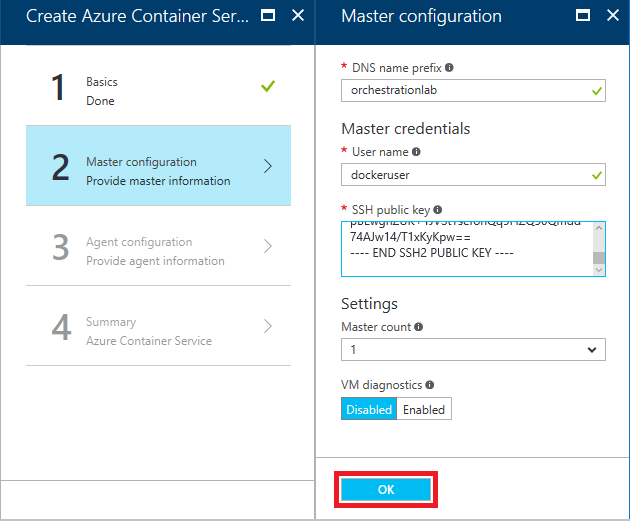

	_Master configuration settings_

1. In the "Agent configuration" blade, set **Agent count** to **2**. Then click **OK**.

	> When you create an Azure Container Service, one or more master VMs are created to orchestrate the workload. In addition, an [Azure Virtual Machine Scale Set](https://azure.microsoft.com/en-us/documentation/articles/virtual-machine-scale-sets-overview/) is created to provide VMs for the "agents," or VMs that the master VMs delegate work to. Docker container instances are hosted in the agent VMs. By default, Azure uses a standard DS2 virtual machine for each agent. These are dual-core machines with 7 GB of RAM. Agent VMs are created as needed to handle the workload. In this example, there will be one master VM and up to two agent VMs.

	

	_Agent configuration settings_

1. In the "Summary" blade, review the settings you selected. Then click **OK**.

	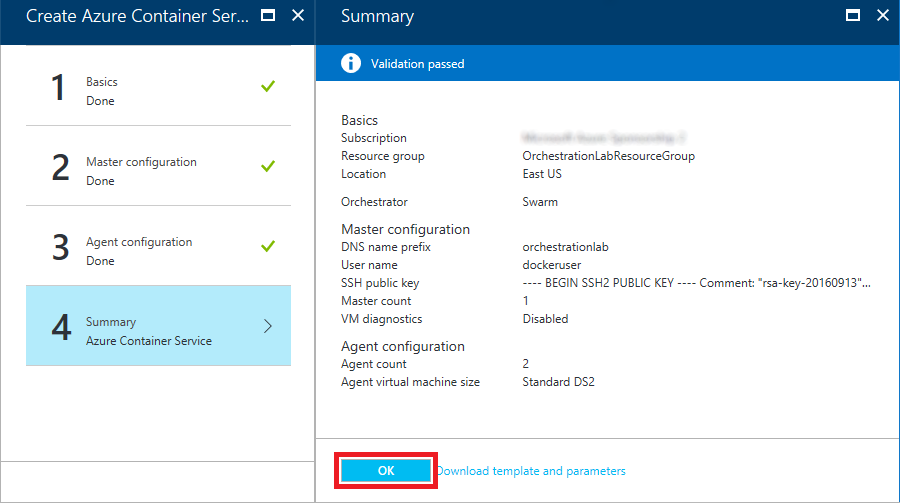

	_Settings summary_

1. Deployment typically takes 5 to 10 minutes. You can monitor the status of the deployment by opening the blade for the resource group created for the container service. Click **Resource groups** in the ribbon on the left. Then click the resource group named "OrchestrationLabResourceGroup."

    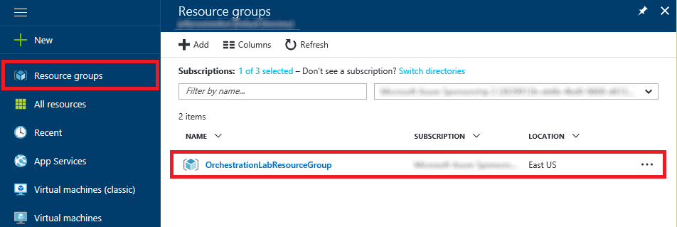

	_Opening the resource group_

1. Wait until "Deploying" changes to "Succeeded," indicating that the service has been successfully deployed. You can click the **Refresh** button at the top of the blade to refresh the deployment status.

    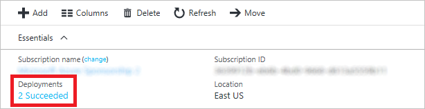

	_Successful deployment_

When the deployment completes successfully, you are ready to proceed. The next step is to get the fully qualified domain name of the master node in preparation for opening a secure connection to the service.

<a name="Exercise3"></a>
## Exercise 3: Record fully qualified domain names ##

In this exercise, you will retrieve fully qualified domain names (FQDNs) for the master node and agent node of the container service you deployed in the previous exercise.

1. In the blade for the "OrchestrationLabResourceGroup" resource group, click the container service.

    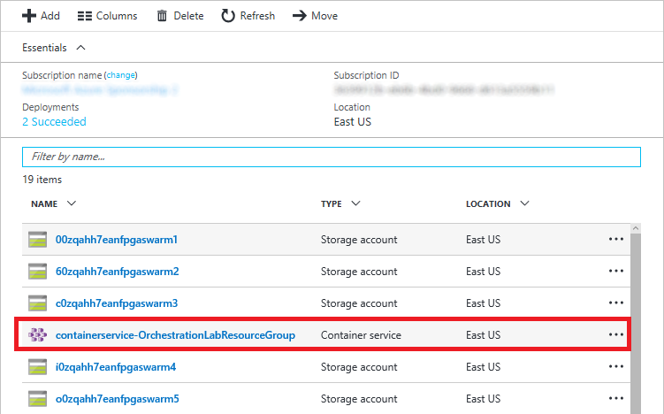

	_Opening the container service_

1. Hover the mouse pointer over the master fully qualified domain name. When a **Copy** button appears, click it to copy the domain name to the clipboard. Then **paste the name into your favorite text editor so you can retrieve it later**. This is the **master FQDN**.

    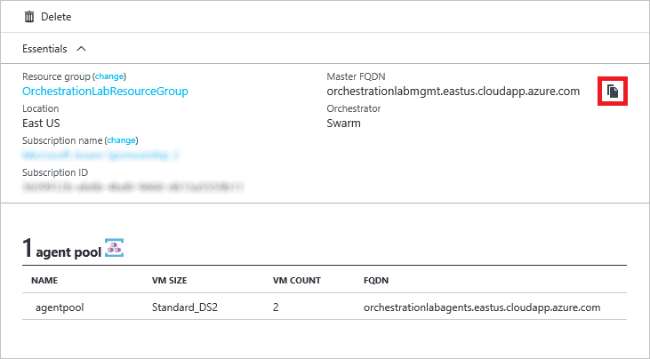

	_Copying the master FQDN to the clipboard_

1. Copy the fully qualified domain name of the agent node to the clipboard and save it in your favorite text editor so you can retrieve it later. This is the **agent FQDN**.

    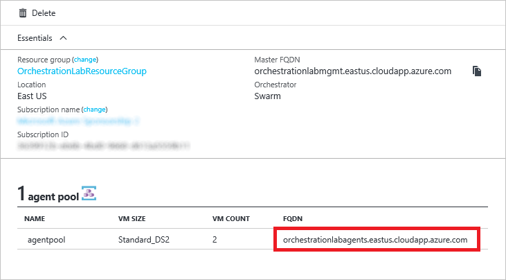

	_Copying the agent FQDN to the clipboard_

You will use the **master FQDN** in the next exercise to establish an SSH tunnel to the master node. You will use the **agent FQDN** in [Exercise 5](#Exercise5) to connect to a PHP Web app running in a container in the agent node.

<a name="Exercise4"></a>
## Exercise 4: Connect to the master node ##

In this exercise, you will establish an SSH connection to the master node of the container service you deployed in [Exercise 2](#Exercise2) so you can use the Docker client to execute Docker commands in Azure.

1. **If you are running Windows, skip to Step 5**. Otherwise, proceed to Step 2.

1. On your Mac or Linux machine, return to the terminal window you opened in Exercise 1 and make sure you are still in the ".ssh" directory containing the key pair that you generated.

1. Execute the following command to SSH in to the master node, replacing *master-fqdn* with the **master FQDN** that you saved in Exercise 3, Step 2:

	<pre>ssh -L 22375:localhost:2375 dockeruser@<i>master-fqdn</i></pre>

	> The purpose of the -L switch is to forward traffic transmitted through port 22375 on the local machine (that's the port used by the **docker** command you will be using shortly) to port 2375 at the other end. Docker Swarm listens on port 2375.

1. If asked to confirm that you wish to connect, answer yes. Once connected, leave the terminal window open and **proceed to [Exercise 5](#Exercise5). The remaining steps in this exercise are for Windows users only**. 

1. Launch PuTTY and paste the **master FQDN** that you saved in Exercise 3, Step 2 into the **Host Name (or IP address)** box.

	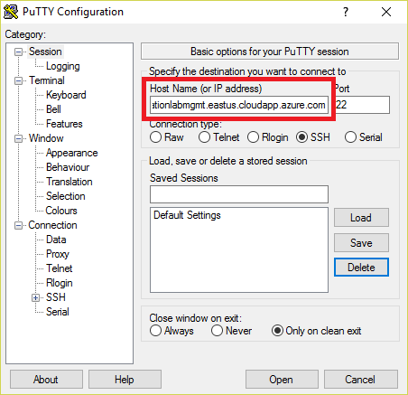

	_Configuring a PuTTY session_

1. In the treeview on the left, click **Data**. Then type the SSH user name "dockeruser" (without quotation marks) into the **Auto-login username** box.

	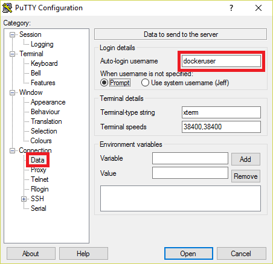

	_Specifying the SSH user name_

1. Click the + sign next to **SSH**, and then click **Auth**. Click the  **Browse** button and select the private-key file that you created in [Exercise 1](#Exercise1).

	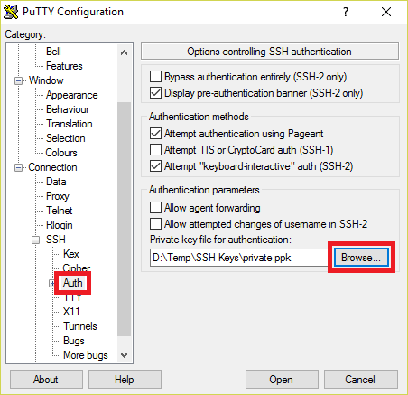

	_Entering the private key_

1. Select **Tunnels** in the treeview. Then set **Source port** to **22375** and **Destination** to **127.0.0.1:2375**, and click the **Add** button. Then click the **Open** button to open a connection to the master node. If you are warned that the server's host key isn't cached in the registry and asked to confirm that you want to connect anyway, click **Yes**.

	> The purpose of this is to forward traffic transmitted through port 22375 on the local machine (that's the port used by the **docker** command you will be using shortly) to port 2375 at the other end. Docker Swarm listens on port 2375.
	
	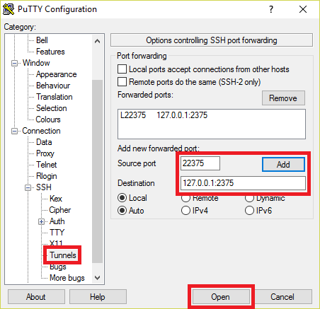

	_Configuring the SSH tunnel_

1. Confirm that an SSH window opens and logs you in, as shown below.

	> Observe that you didn't have to enter a password. That's because the connection was authenticated using the public/private key pair you generated in Exercise 1. Key pairs tend to be much more secure than passwords because they are cryptographically strong. You also didn't have to enter a user name because you provided the user name to PuTTY in Step 6.

	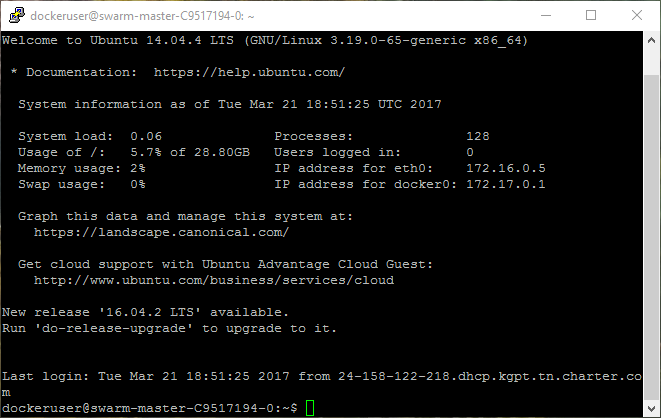

	_he SSH terminal window_

Now that you're connected, you can run the Docker client on your local machine and use port forwarding to execute commands in the Azure Container Service. Leave the SSH window open while you work through the next exercise.
	
<a name="Exercise5"></a>
## Exercise 5: Create a Docker image, push it to Docker Hub, and run it in a container ##

The next step is to build a container image and upload it to an image repository. [Docker Hub](https://hub.docker.com/) is Docker's public image repository, and it is basically the mother of all other Docker repositories. Most custom Docker images originate from a base image stored in Docker Hub. The "resources" folder of this lab contains a simple PHP app that shows system information regarding the host server in a Web page. Accompanying the app is a file named **Dockerfile**, which contains instructions for building a Docker image. This Dockerfile is simple: it starts with a base image for PHP and exposes a TCP port for the Web server.

In this exercise, you will build a Docker image and push it to Docker Hub. Then you will run the image in a container hosted in Azure.

1. Open a terminal window (macOS or Linux) or a Command Prompt window (Windows) and navigate to the "resources" folder of this lab. It contains the files that you will build into a container image.

1. If you are running macOS or Linux, execute the following command in the terminal window:

	<pre>export DOCKER_HOST=localhost:22375</pre>

	If you are running Windows instead, execute this command in the Command Prompt window:

	<pre>set DOCKER_HOST=localhost:22375</pre>

	> This command directs the Docker client to send output to localhost port 22375, which you redirected to port 2375 in the Azure Container Service in the previous exercise. Remember that port 2375 is the one Docker Swarm listens on. The commands that you execute in the next few steps are typed into a local terminal window, but they are **executed in the container service you deployed to the cloud** using the SSH tunnel that you established in the previous exercise.

1. In the Command prompt or terminal window, execute the following command to log into Docker Hub. When prompted, enter your Docker ID and password.

	> If you don't have a Docker ID, you can [sign up for one](https://hub.docker.com/) at no cost.

	```
	docker login
	```

1. Make sure you are in this lab's "resources" directory. Then use the following command to build a Docker image from the files in the current directory, substituting your Docker ID for *dockerid*. This is the same Docker ID you used to sign in to Docker Hub in the previous step.

	<pre>docker build --tag <i>dockerid</i>/container-info --no-cache .</pre>

	This command uploads the files in the current directory to the Docker Engine running on Azure. The Docker Engine then builds a Docker image using the commands in the Dockerfile and stores the image in a local repository.

1. Now use the following command to push the image to Docker Hub, once more substituting your Docker ID for *dockerid*.

	<pre>docker push <i>dockerid</i>/container-info</pre>

	> If you would like to view the image in Docker Hub, simply point your browser to https://hub.docker.com/r/dockerid/container-info/ and substitute your Docker ID for *dockerid*.

1. Next, use the following command to create a container from the image pushed to Docker Hub and run  the container, again substituting your Docker ID for *dockerid*: 

	<pre>docker run -dit --name c-info -p 80:80 <i>dockerid</i>/container-info</pre>

1. Open a browser and paste the **agent FQDN** that you saved in Exercise 3, Step 3 into the browser's address bar. Notice the information displayed in the browser window, particularly the system information on line 1. Can you guess what operating system is installed in the agent VM?

	

	_Web page served up by a PHP app running in a container managed by Swarm in Azure_

At the moment, there is only one container instance running in the agent VM. Docker Swarm is capable of deploying multiple container instances and load-balancing requests targeting those instances, but the version of Docker Swarm currently installed on the cluster lacks these capabilities. Not to fear, however; you will soon be launching multiple container instances using DC/OS and Kubernetes.

<a name="Exercise6"></a>
## Exercise 6: Delete the resource group ##

In this exercise, you will delete the resource group created in [Exercise 2](#Exercise2). Deleting the resource group deletes everything in it and prevents any further charges from being incurred for it, including for the VMs deployed as part of the container service.

1. In the Azure Portal, open the blade for the "OrchestrationLabResourceGroup" resource group. Then click the **Delete** button at the top of the blade.

	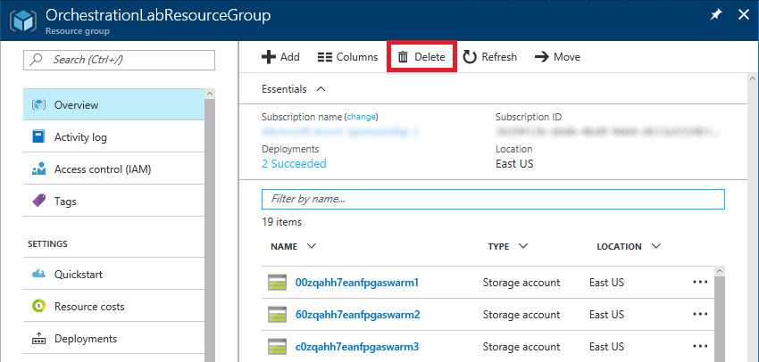

	_Deleting a resource group_

1. For safety, you are required to type in the resource group's name. (Once deleted, a resource group cannot be recovered.) Type the name of the resource group. Then click the **Delete** button to remove all traces of this lab from your account.

After a few minutes, you will be notified that the resource group was deleted. If the deleted resource group still appears in the "Resource groups" blade, click that blade's **Refresh** button to update the list of resource groups. The deleted resource group should go away.  

<a name="Exercise7"></a>
## Exercise 7: Orchestrate with DC/OS ##

In this exercise, you will deploy a new container service and use [DC/OS](https://dcos.io/) for orchestration. DC/OS stands for Datacenter Operating System and is built on top of [Apache Mesos](http://mesos.apache.org/). DC/OS abstracts the underlying operating system and supports many of the functions typically performed by operating systems across multiple nodes on a cluster. Containers are one such resource that can be managed by DC/OS. In Azure, DC/OS is tailored for this purpose. 

1. Repeat the steps in [Exercise 2](#Exercise2), but this time choose **DC/OS** as the orchestrator in Step 3.

	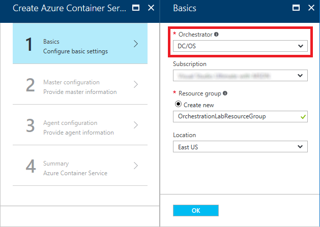

	_Creating a container service with DC/OS_

1. Repeat [Exercise 3](#Exercise3) to obtain the **master FQDN** and **agent FQDN** for the container service.

	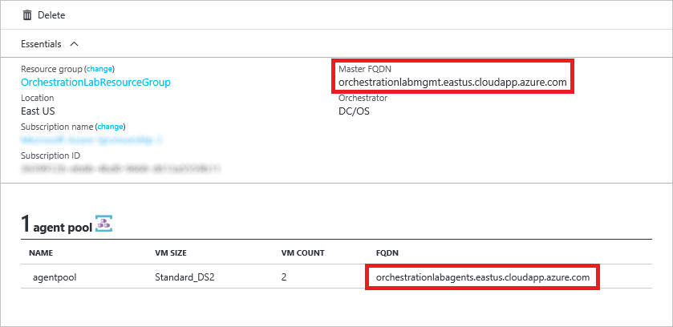

	_Copying the master and agent FQDNs_

1. Repeat [Exercise 4](#Exercise4) to connect to the master node. For macOS and Linux, modify the command in Exercise 4, Step 3 to forward port 8000 to localhost:80:

	<pre>ssh -L 8000:localhost:80 dockeruser@<i>master-fqdn</i></pre>

	For Windows, modify Exercise 4, Step 8 by setting **Source port** to **8000** and **Destination** to **localhost:80**, as shown below.

	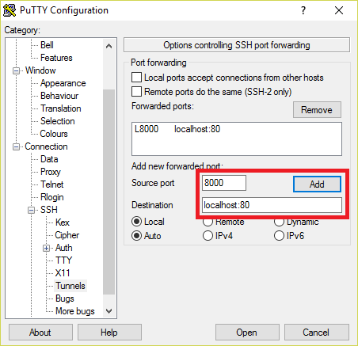

	_Configuring the SSH tunnel_

1. Open a browser and enter http://localhost:8000 into the address bar. This will load the DC/OS dashboard.

	> The *localhost* in the URL implies that the DC/OS dashboard is running locally, but it's not. Calls to port 8000 on the local machine are being redirected to the remote machine through the SSH tunnel that you established.

	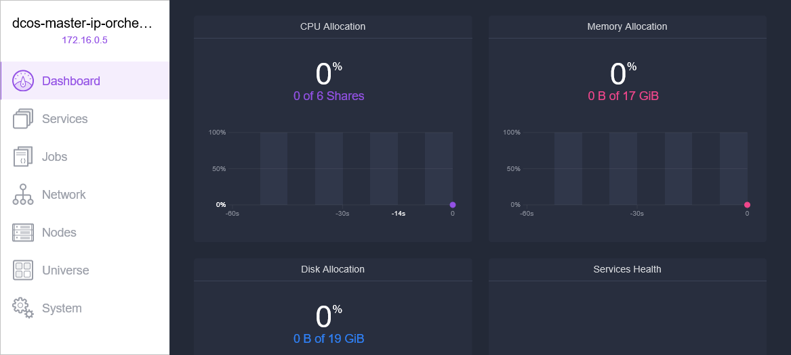

	_The DC/OS dashboard_

1. The next step is to install a load balancer on DC/OS so that it can balance and monitor incoming requests to containers. In the dashboard, click **Universe**. Then type "marathon-lb" into the search box and click **Install** to install the [Marathon load balancer](https://docs.mesosphere.com/1.8/usage/service-discovery/marathon-lb/). 

	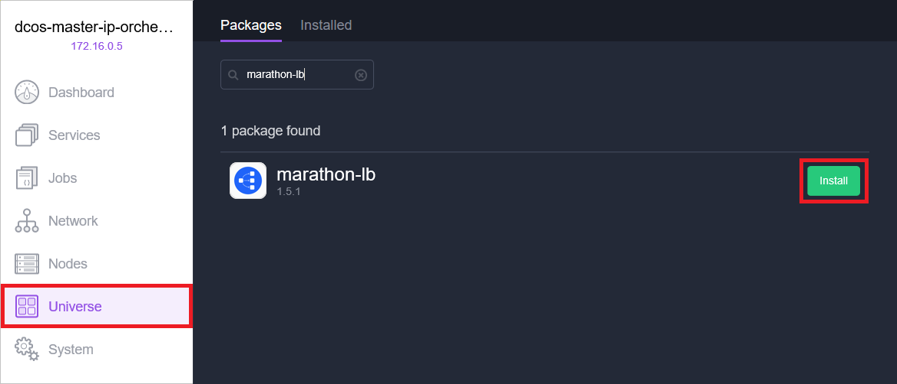

	_Installing the Marathon load balancer_

1. Click **Install Package** to proceed with the installation. Once installation is complete, click **OK** to dismiss the success dialog.

	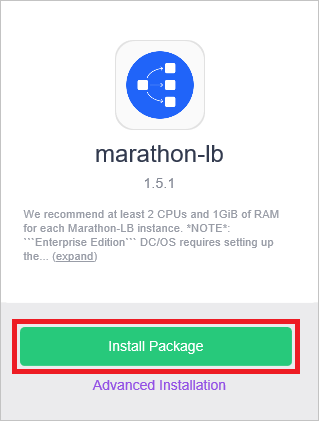

	_Starting the installation_

1. Navigate to http://localhost:8000/marathon in your browser. This will load the console for [Marathon](https://github.com/mesosphere/marathon), which is used for orchestration on DC/OS. You will see that marathon-lb is already listed under Applications. Click the **Create Application** button.

	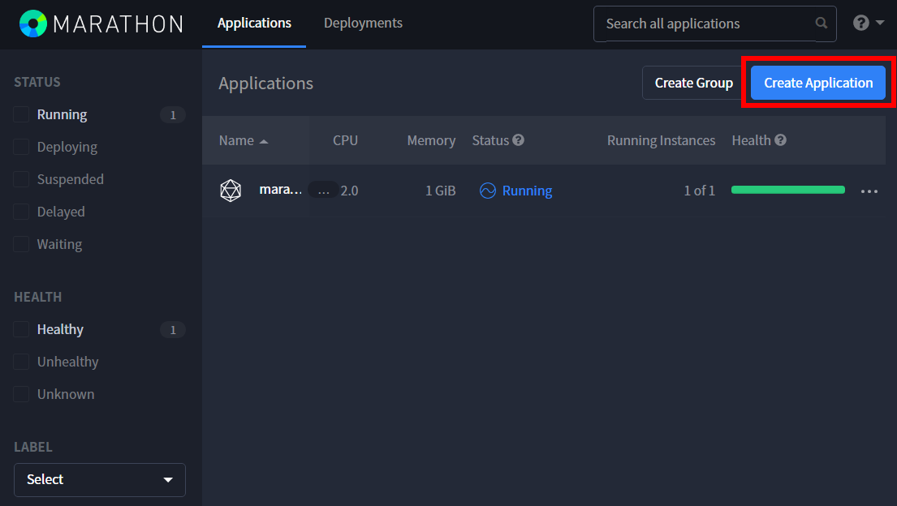

	_Creating an application_

1. Click **JSON Mode** in the upper-right corner. Then paste in the following JSON, replacing *dockerid* in line 6 with your Docker ID and *agent-fqdn* on line 28 with the **agent FQDN** from Step 2. Then click **Create Application**. This will begin the process of starting 10 container instances.

	```JSON
	{
	  "id": "info",
	  "container": {
	    "type": "DOCKER",
	    "docker": {
	      "image": "dockerid/container-info",
	      "network": "BRIDGE",
	      "portMappings": [
	        { "hostPort": 0, "containerPort": 80, "servicePort": 10000 }
	      ],
	      "forcePullImage":true
	    }
	  },
	  "instances": 10,
	  "cpus": 0.5,
	  "mem": 128,
	  "healthChecks": [{
	      "protocol": "HTTP",
	      "path": "/",
	      "portIndex": 0,
	      "timeoutSeconds": 10,
	      "gracePeriodSeconds": 10,
	      "intervalSeconds": 2,
	      "maxConsecutiveFailures": 10
	  }],
	  "labels":{
	    "HAPROXY_GROUP":"external",
	    "HAPROXY_0_VHOST":"agent-fqdn",
	    "HAPROXY_0_MODE":"http"
	  }
	}
	```

	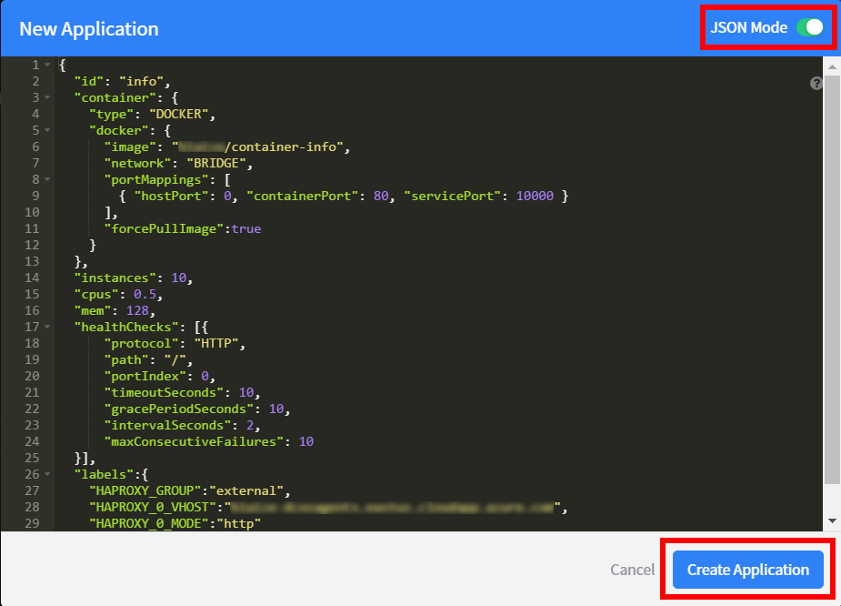

	_Creating the new application_

1. Open a new browser window and paste the **agent FQDN** into the address bar to connect to the PHP app running in a container managed by DC/OS. Refresh the page a few times. Notice how the info on the first line changes each time. This is because the load balancer is redirecting to a different container with each refresh.

	

	_Web page served up by a PHP app running in a container managed by DC/OS in Azure_

Finish up by repeating [Exercise 6](#Exercise6) to delete the resource group. You will be creating a new container service in the next exercise. 

<a name="Exercise8"></a>
## Exercise 8: Orchestrate with Kubernetes ##

In this exercise, you will deploy a new container service that uses [Kubernetes](https://kubernetes.io/) for orchestration. Kubernetes is Google's homegrown orchestration engine. The project started to meet a need within Google, but its popularity grew such that Google released it as open source. It is quickly becoming a popular orchestration platform and has recently been added to the Azure Container Service. Kubernetes is slightly different from DC/OS and Swarm because it can control some of the resources on the Azure deployment that is hosting it. To do this, it requires a *service principal*, which is in effect a delegate that can access an Azure subscription.

1. In the Azure Portal, click **Azure Active Directory** in the ribbon on the left. Then click **App registrations**, followed by **Add**.

	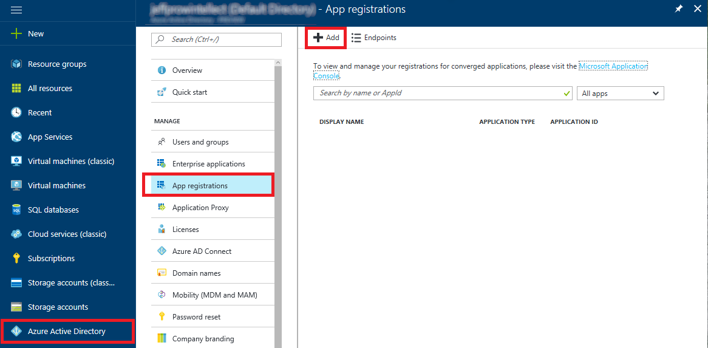

	_Adding an app registration_

1. In the "Create" blade, enter "Kubernetes" as the app name and "http://localhost" as the sign-on URL. Then click **Create**.

	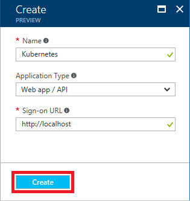

	_Registering a Kubernetes app_

1. Click **Kubernetes**.

	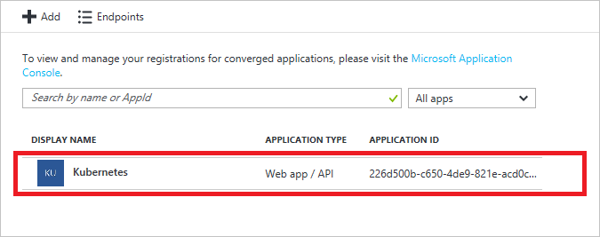

	_Opening the Kubernetes app_

1. Click **Keys**. Type "key1" into the **Description** field and set **Expires** to **Never expires**. Then click **Save**.

	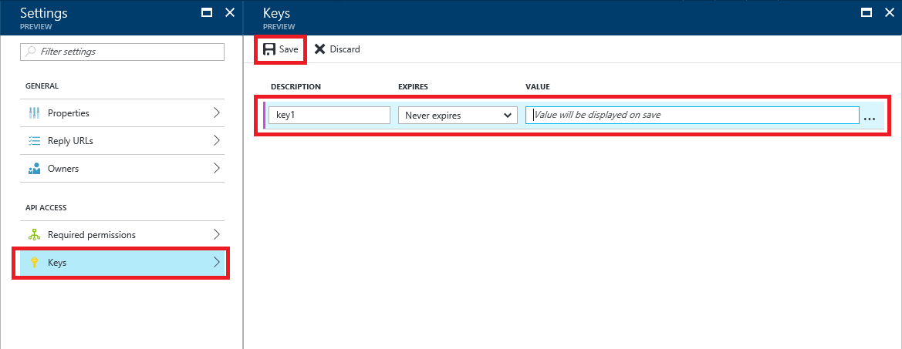

	_Adding an application key_

1. Copy **key1**'s value to the clipboard and paste it into your favorite text editor. **You will not be able to retrieve this key again from the Azure Portal**.

	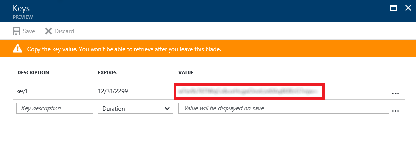

	_Copying the application key_

1. Return to the blade for the "Kubernetes" app and copy the application ID to the clipboard. Then paste the application ID into a text editor so you can retrieve it later.

	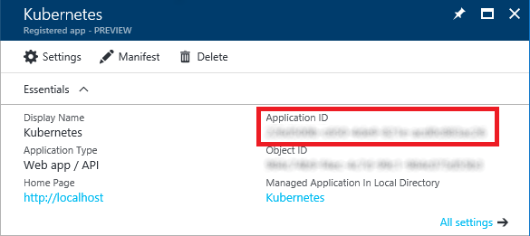

	_Copying the application ID_

1. Now click **Subscriptions** in the ribbon on the left side of the portal and select the subscription that you are using for this lab.

	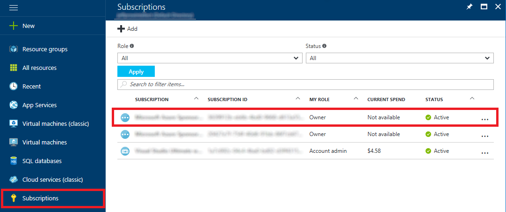

	_Choosing a subscription_

1. Click **Access control (IAM)**, and then click **Add**.

	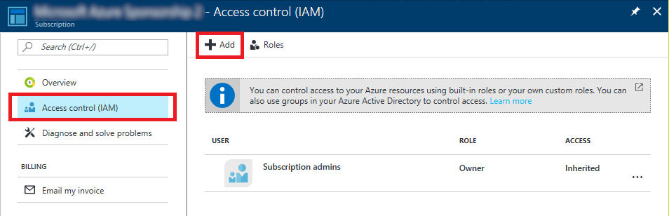

	_Adding a user to the subscription_

1. Click **Contributor**.

	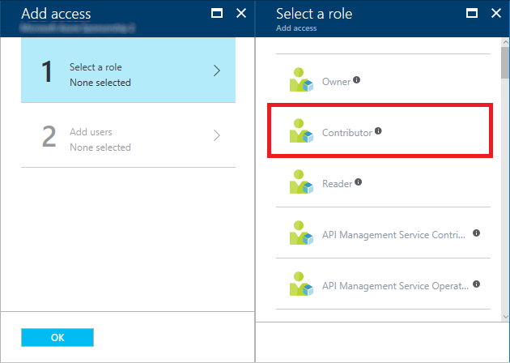

	_Defining the user's role_

1. Type "kubernetes" into the search box and select **Kubernetes**. Then click the **Select** button at the bottom of the "Add Users" blade, followed by the **OK** button at the bottom of the "Add access" blade.

	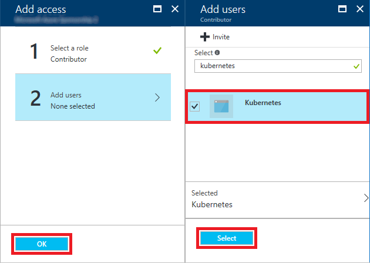

	_Specifying which user to add_

1. Repeat [Exercise 2](#Exercise2) to deploy a new container service, but with the following changes:
 
	- In Step 3, choose **Kubernetes** as the orchestrator.

		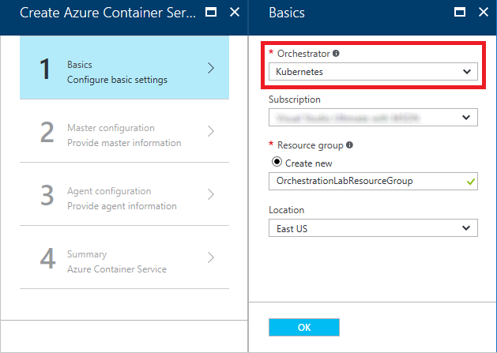
	
		_Creating a container service with Kubernetes_

	- In Step 4, enter the application ID you saved in Step 6 of this exercise for **Service principal client ID**, and the key value you saved in Step 5 of this exercise for **Service principal client secret**.

		
	
		_Master configuration settings_

	- In Step 5, select **Linux** as the operating system.	

		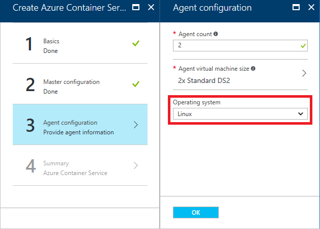
	
		_Agent configuration settings_

1. Repeat [Exercise 3](#Exercise3) to obtain the **master FQDN** for the container service. Note that there is no agent FQDN in this case.

	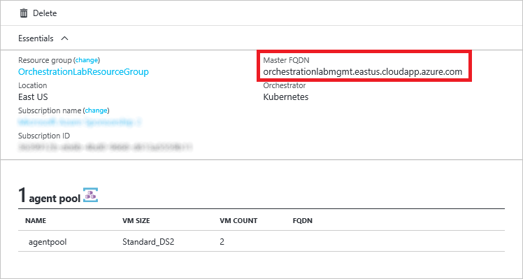

	_Copying the master FQDN_

1. Repeat [Exercise 4](#Exercise4) to connect to the master node. For macOS and Linux, modify the command in Exercise 4, Step 3 to forward port 8001 to localhost:8001:

	<pre>ssh -L 8001:localhost:8001 dockeruser@<i>master-fqdn</i></pre>

	For Windows, modify Exercise 4, Step 8 by setting **Source port** to **8001** and **Destination** to **localhost:8001**, as shown below.

	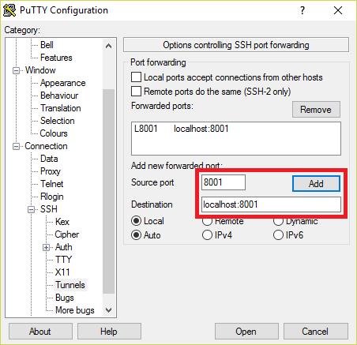

	_Configuring the SSH tunnel_

1. Once the SSH client is connected, you need to create a proxy to access Kubernetes. In the SSH terminal window, execute the following command:

	```
	kubectl proxy
	```

1. Open a browser window and navigate to http://localhost:8001/ui to open the Kubernetes console. Then click **+ Create**.

	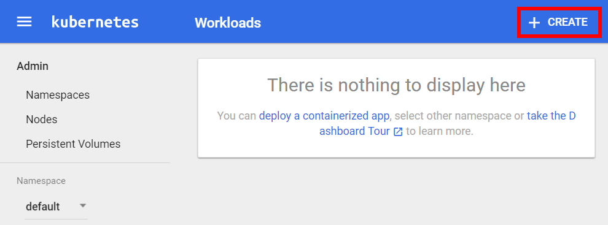

	_Creating an app in Kubernetes_

1. Enter "container-info" for the **App name** and "*dockerid*/container-info" for **Container image**, replacing *dockerid* with your Docker ID. Enter **10** for **Number of pods** and set **Service** to **External**. Set **Port** to **80** and **Target port** to **80**. Then click **Deploy**.

	> Setting the number of pods to 10 tells Kubernetes to deploy 10 container instances.

	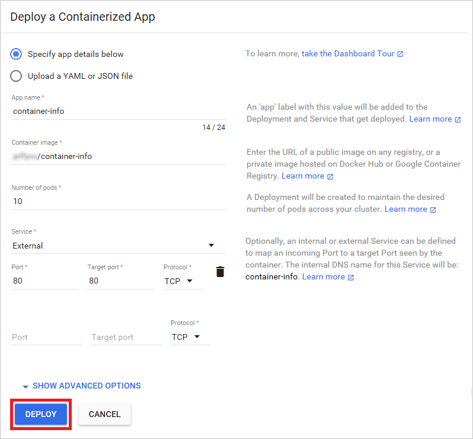

	_Deploying a containerized app_

1. Wait until several containers have been deployed and have a status of "Running." Refresh the page in the browser periodically to update the status.

	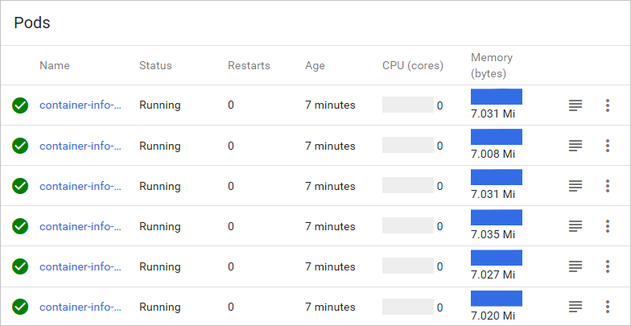

	_Monitoring the deployment status_

1. Click **Services** in the navigation bar, and then click the IP address under **External endpoints** to connect to a running container instance. 

	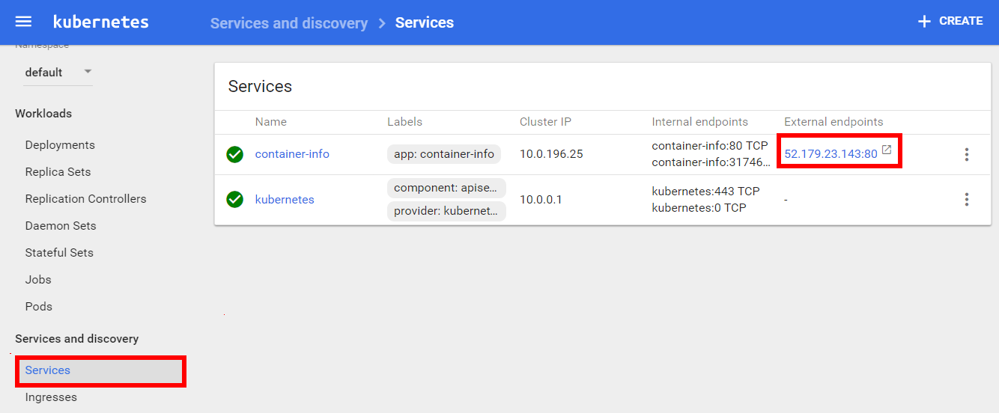

	_Connecting to a running container_

1. Click the IP address under **External endpoints** several more times to open multiple browser tabs. Observe that the system info on line 1 is different for each tab. That's because each tab is connected to a different container instance.

	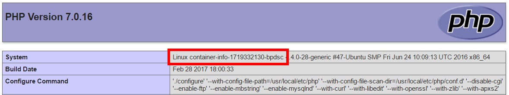

	_Web page served up by a PHP app running in a container managed by Kubernetes in Azure_

Finish up by repeating [Exercise 6](#Exercise6) to delete the resource group and avoid incurring any additional charges for this lab.

<a name="Summary"></a>
## Summary ##

In this lab, you created a Docker container image, pushed it to Docker Hub, and deployed it to the three different container services configured with different orchestration tools. Swarm, DC/OS, and Kubernetes work differently, but each provides a solution to managing "swarms" of containers on clusters of virtual or physical machines. And each is supported natively in Azure. To learn more about these tools and the features that they offer, check out the documentation for [Swarm](https://docs.docker.com/engine/swarm/), [DC/OS](https://dcos.io/) and [Kubernetes](https://kubernetes.io/), respectively.

---

Copyright 2017 Microsoft Corporation. All rights reserved. Except where otherwise noted, these materials are licensed under the terms of the MIT License. You may use them according to the license as is most appropriate for your project. The terms of this license can be found at https://opensource.org/licenses/MIT. 


