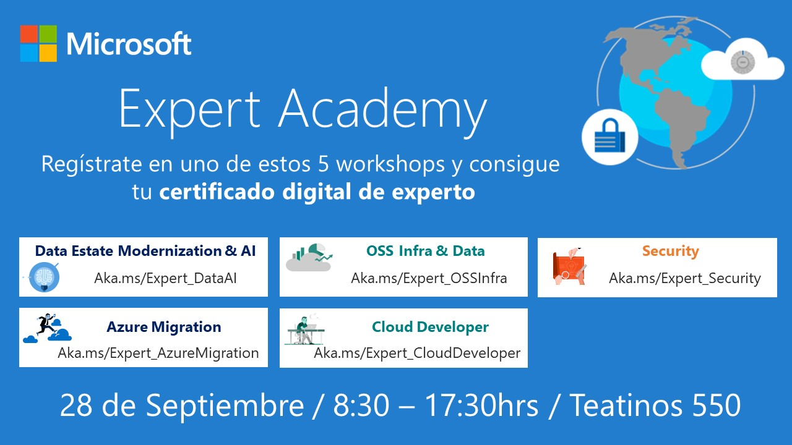

# Expert Academy Santiago 2018!

  

## Taller Contenedores Producción con Kubernetes

Bienvenidos al taller introductorio para contenedores en producción con Kubernetes del Expert Academy 2018 de Microsoft.

En este taller aprenderemos los siguientes conceptos:

*   Cloud Native Applications
*   Orquestadores de Contenedores
*   Conceptos de Kubernetes
    *   Arquitectura Kubernetes
        *   Master Nodes
            *   Controller API
        *   Worker Nodes
            *   Kubelet
    *   Deployments, Pods, Services
    * Secretos
* Ecosistema de Contenedores Azure
* OSS tools Kubernetes

## Laboratorio Práctico
*   [Parte 1: Aplicación Heroes MEAN en AKS](https://feranto.github.io/azureDemos/OpenDevFrameworks/Kubernetes/Expert-Academy-Kubernetes/)
*   [Parte 2: Escalando usando Contenedores Serverless](https://github.com/Azure/blackbelt-aks-hackfest/blob/master/labs/day2-labs/virtual-kubelet-aci.md)
*   [Parte 3: Probando Draft](https://github.com/Azure/draft/blob/master/docs/getting-started.md)