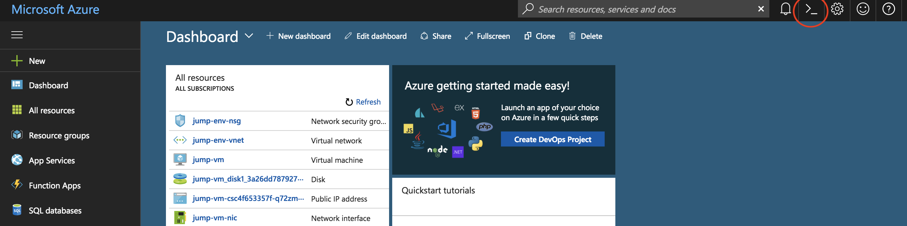

# Orquestando webservices de machine learning en python con Kubernetes

## Pre-requisitos ##

* Ver este genial Video(Guia Ilustrada de Kubernetes para niños):

[](https://youtu.be/4ht22ReBjno)

*	Instalar [git](https://git-scm.com/downloads)
*	Instalar [nodejs](https://nodejs.org/es/download/)
*	Instalar [Visual Studio Code](https://code.visualstudio.com/download)
*	Si no tienes suscripción de Azure, Activar [Visual Studio Dev Essentials](https://www.visualstudio.com/es/dev-essentials/)
*	Activar suscripción de 25 USD mensuales de Azure durante 12 meses


## Creación de Imagenes Docker ##
### Creación de vm Linux ###

*   Primero accedemos a la [consola web de azure](http://shell.azure.com/)
*   Luego procedemos a definir algunas variables que usaremos
```bash 
    RG_NAME=MlDockerTutorial  
    VM_NAME=MlUbuntuVm
    REGION=eastus
```
*   Luego procedemos a crear un grupo de recursos
```bash 
az group create --name $RG_NAME --location $REGION
```
*   Una vez creado el grupo de recurso, creamos una vm ubuntu
```bash 
az vm create --resource-group $RG_NAME \
  --name $VM_NAME \
  --image UbuntuLTS \
  --generate-ssh-keys \
  --size Standard_DS4 \
  --verbose
```
*   Una vez creada la vm, buscamos la dirección de la IP pública y nos conectamos vía ssh
```bash 
PUBLIC_IP_ADDRESS=<YOUR_PUBLIC_IP_ADDRESS>
```
```bash 
ssh $PUBLIC_IP_ADDRESS
```
### Instalación Docker ###
#### Configuración repositorio Docker
*   Actualización de indices de paquetes apt
```bash 
sudo apt-get update
```
*   instalacion de paquetes apt 
```bash 
sudo apt-get install \
    apt-transport-https \
    ca-certificates \
    curl \
    software-properties-common
```
*   agregamos la llave oficial GPG de docker
```bash 
curl -fsSL https://download.docker.com/linux/ubuntu/gpg | sudo apt-key add -
```
*   seteamos el repositorio estable de docker
```bash 
sudo add-apt-repository \
   "deb [arch=amd64] https://download.docker.com/linux/ubuntu \
   $(lsb_release -cs) \
   stable"
```
####   Instalando Docker CE en ubuntu
*   Actualización de indices de paquetes apt
```bash 
sudo apt-get update
```
*   Instalacion de paquete más reciente
```bash 
sudo apt-get install docker-ce
```
*   Verificación de que docker esta funcionando
```bash 
sudo docker run hello-world
```

#### Administrar docker como usuario no-root
*   Creación grupo docker
```bash 
sudo groupadd docker
```
*   Agregamos nuestro usuario al grupo
```bash 
sudo usermod -aG docker $USER
```
*   Hacemos log out y volvemos a loguearnos
```bash 
exit
```
```bash 
ssh <PUBLIC_IP_ADDRESS>
```

*   Verificamos que podamos correr docker sin usuario root
```bash 
docker run hello-world
```

*   [Comandos Básicos Docker](https://github.com/feranto/azureDemos/tree/master/OpenDevFrameworks/Docker/docker-101#comandos-básicos-de-docker)

### Dockerfiles ###

*   [Como se estructura un Dockerfile](https://github.com/feranto/azureDemos/tree/master/OpenDevFrameworks/Docker/docker-101#definiendo-nuestro-contenedor-con-dockerfile)


### Imágenes ###

### Ejecución en vm ###

*   Primero descargamos el dockerfile ya creado a nuestra vm con el siguiente comando
```bash 
curl https://raw.githubusercontent.com/feranto/azureDemos/master/OpenDevFrameworks/Kubernetes/Kubernetes-MachineLearning/recursos/PythonWebservice/Dockerfile > py-manualtransmission-dockerfile 
```
*   Ejecutamos el siguiente comando para crear la imagen
  ```bash 
docker build -f py-manualtransmission-dockerfile -t pymanualtransmission .
```
*   Verificamos que la imagen este en nuestro entorno local
```bash 
docker images
```
*   Ejecutamos la imagen localmente
```bash 
docker run --name pymanualtransmission-container -dit pymanualtransmission
```
*   Verificamos el status del contenedor
```bash 
docker logs pymanualtransmission-container
```
*   Obtenemos la dirección ip interna del contenedor
```bash 
docker inspect -f '{{range .NetworkSettings.Networks}}{{.IPAddress}}{{end}}' pymanualtransmission-container 
```
*   Ejecutamos los siguientes comandos para obtener el archivo swagger
```bash 
sudo apt-get -y install jq
```

```bash 
curl -s --header "Content-Type: application/json" --request POST --data '{"username":"admin","password":"Microsoft@2018"}' http://172.17.0.2:12800/login | jq -r '.access_token'
```


```bash 
curl -s --header "Content-Type: application/json" --header "Authorization: Bearer <access token>" --request POST --data '{"hp":120,"wt":2.8}' http://172.17.0.2:12800/api/ManualTransmissionService/1.0.0 
```

```bash 

curl -s --header "Authorization: Bearer <access token>" --request GET http://172.17.0.2:12800/api/ManualTransmissionService/1.0.0/swagger.json -o swagger.json
```

### Guardando las imagenes en un registro ###

#### Azure Container Registry (ACR)

Now that we have container images for our application components, we need to store them in a secure, central location. In this lab we will use Azure Container Registry for this.

#### Create Azure Container Registry instance

1. In the browser, sign in to the Azure portal at https://portal.azure.com.
2. Click "Create a resource" and select "Container Registry"
3. Provide a name for your registry (this must be unique)
4. Use the existing Resource Group
5. Enable the Admin user
6. Use the 'Standard' SKU (default)

    > The Standard registry offers the same capabilities as Basic, but with increased storage limits and image throughput. Standard registries should satisfy the needs of most production scenarios.

#### Login to your ACR with Docker

1. Browse to your Container Registry in the Azure Portal
2. Click on "Access keys"
3. Make note of the "Login server", "Username", and "password"
4. In the terminal session on the jumpbox, set each value to a variable as shown below

    ```
    # set these values to yours
    ACR_SERVER=
    ACR_USER=
    ACR_PWD=

    docker login --username $ACR_USER --password $ACR_PWD $ACR_SERVER
    ```

#### Tag images with ACR server and repository 

```
# Be sure to replace the login server value

docker tag pymanualtransmission $ACR_SERVER/azureworkshop/pymanualtransmission:v1

```

#### Push images to registry

```
docker push $ACR_SERVER/azureworkshop/pymanualtransmission:v1

```

Output from a successful `docker push` command is similar to:

```
The push refers to a repository [mycontainerregistry.azurecr.io/azureworkshop/pymanualtransmission]
035c23fa7393: Pushed
9c2d2977a0f4: Pushed
d7b18f71e002: Pushed
ec41608c0258: Pushed
ea882d709aca: Pushed
74bae5e77d80: Pushed
9cc75948c0bd: Pushed
fc8be3acfc2d: Pushed
f2749fe0b821: Pushed
ddad740d98a1: Pushed
eb228bcf2537: Pushed
dbc5f877c367: Pushed
cfce7a8ae632: Pushed
v1: digest: sha256:f84eba148dfe244f8f8ad0d4ea57ebf82b6ff41f27a903cbb7e3fbe377bb290a size: 3028
```

#### Validate images in Azure

1. Return to the Azure Portal in your browser and validate that the images appear in your Container Registry under the "Repositories" area.
2. Under tags, you will see "v1" listed.


# Creación de Cluster AKS 

1. Login to Azure Portal at http://portal.azure.com. 
2. Open the Azure Cloud Shell

    

3. The first time Cloud Shell is started will require you to create a storage account. In our lab, you must click `Advanced` and enter an account name and share.

4. In the cloud shell, you are automatically logged into your Azure subscription. ```az login``` is not required.
    
5. Verify your subscription is correctly selected as the default
    ```
    az account list
    ```

6. Find your RG name

    ```
    az group list 
    ```
    
    ```

    [
    {
        "id": "/subscriptions/b23accae-e655-44e6-a08d-85fb5f1bb854/resourceGroups/ODL-aks-v2-gbb-8386",
        "location": "centralus",
        "managedBy": null,
        "name": "ODL-aks-v2-gbb-8386",
        "properties": {
        "provisioningState": "Succeeded"
        },
        "tags": {
        "AttendeeId": "8391",
        "LaunchId": "486",
        "LaunchType": "ODL",
        "TemplateId": "1153"
        }
    }
    ]

    # copy the name from the results above and set to a variable 
    
    NAME=

    # We need to use a different cluster name, as sometimes the name in the group list has an underscore, and only dashes are permitted
    
    CLUSTER_NAME="${NAME//_}"
    
    ```

7. Create your AKS cluster in the resource group created above with 2 nodes, targeting Kubernetes version 1.7.7
    ```
    # This command can take 5-25 minutes to run as it is creating the AKS cluster. Please be PATIENT...
    
    # set the location to one of the provided AKS locations (eg - centralus, eastus)
    LOCATION=

    az aks create -n $CLUSTER_NAME -g $NAME -c 2 -k 1.10.3 --generate-ssh-keys -l $LOCATION
    ```

8. Verify your cluster status. The `ProvisioningState` should be `Succeeded`
    ```
    az aks list -o table

    Name                 Location    ResourceGroup         KubernetesVersion    ProvisioningState    Fqdn
    -------------------  ----------  --------------------  -------------------  -------------------  -------------------------------------------------------------------
    ODLaks-v2-gbb-16502  centralus   ODL_aks-v2-gbb-16502  1.7.7                Succeeded             odlaks-v2--odlaks-v2-gbb-16-b23acc-17863579.hcp.centralus.azmk8s.io
    ```


9.  Get the Kubernetes config files for your new AKS cluster
    ```
    az aks get-credentials -n $CLUSTER_NAME -g $NAME
    ```

10. Verify you have API access to your new AKS cluster

    > Note: It can take 5 minutes for your nodes to appear and be in READY state. You can run `watch kubectl get nodes` to monitor status. 
    
    ```
    kubectl get nodes
    
    NAME                       STATUS    ROLES     AGE       VERSION
    aks-nodepool1-20004257-0   Ready     agent     4m        v1.7.7
    aks-nodepool1-20004257-1   Ready     agent     4m        v1.7.7
    ```
    
    To see more details about your cluster: 
    
    ```
    kubectl cluster-info
    
    Kubernetes master is running at https://odlaks-v2--odlaks-v2-gbb-11-b23acc-115da6a3.hcp.centralus.azmk8s.io:443
    Heapster is running at https://odlaks-v2--odlaks-v2-gbb-11-b23acc-115da6a3.hcp.centralus.azmk8s.io:443/api/v1/namespaces/kube-system/services/heapster/proxy
    KubeDNS is running at https://odlaks-v2--odlaks-v2-gbb-11-b23acc-115da6a3.hcp.centralus.azmk8s.io:443/api/v1/namespaces/kube-system/services/kube-dns:dns/proxy
    kubernetes-dashboard is running at https://odlaks-v2--odlaks-v2-gbb-11-b23acc-115da6a3.hcp.centralus.azmk8s.io:443/api/v1/namespaces/kube-system/services/kubernetes-dashboard/proxy

    To further debug and diagnose cluster problems, use 'kubectl cluster-info dump'.
    ```

You should now have a Kubernetes cluster running with 2 nodes. You do not see the master servers for the cluster because these are managed by Microsoft. The Control Plane services which manage the Kubernetes cluster such as scheduling, API access, configuration data store and object controllers are all provided as services to the nodes. 

# Despliegue de imagenes en el cluster 

## Review/Edit the YAML Config Files

1. En el Azure Cloud Shell vamos a descargar el archivo yaml de kubernetes
    ```bash
    curl https://raw.githubusercontent.com/feranto/azureDemos/master/OpenDevFrameworks/Kubernetes/Kubernetes-MachineLearning/recursos/KubernetesDeploymentFiles/pymanualtransmission.yaml -o pymanualtransmission.yaml
    ```

2. In Azure Cloud Shell edit `pymanualtransmission.yaml.yaml` using `vi`
    ```

    vi pymanualtransmission.yaml
    ```
    * Review the yaml file and learn about some of the settings. Note the environment variables that allow the services to connect
    * Update the yaml file for the proper container image names.
    * You will need to replace the `<login server>` with the ACR login server created in lab 2
        > Note: You will update the image name TWICE updating the web and api container images.

    * Example: 

        ```
        containers:
        - image: <login server>/azureworkshop/pymanualtransmission:v1
          name:  pymanualtransmission-cntnr
          resources:
            requests:
        ```

## Setup AKS with access to Azure Container Registry

There are a few ways that AKS clusters can access your private Azure Container Registry. Generally the service account that kubernetes utilizes will have rights based on its Azure credentials. In our lab config, we must create a secret to allow this access. 

```
# set these values to yours
ACR_SERVER=
ACR_USER=
ACR_PWD=

kubectl create secret docker-registry acr-secret --docker-server=$ACR_SERVER --docker-username=$ACR_USER --docker-password=$ACR_PWD --docker-email=superman@heroes.com
```

> Note: You can review the `pymanualtransmissionyaml` ato see where the `imagePullSecrets` are configured.

## Desplegamos el webservice en el cluster de kubernetes

* Use the kubectl CLI to deploy each app
    ```
    kubectl apply -f pymanualtransmission.yaml
    ```

* Check to see if pods are running in your cluster
    ```
    kubectl get pods

    NAME                                 READY     STATUS    RESTARTS   AGE
    heroes-api-deploy-1140957751-2z16s   1/1       Running   0          2m
    heroes-db-deploy-2357291595-k7wjk    1/1       Running   0          3m
    heroes-web-1645635641-pfzf9          1/1       Running   0          2m
    ```

* Check to see if services are deployed.
    ```
    kubectl get service

    NAME         TYPE           CLUSTER-IP    EXTERNAL-IP      PORT(S)          AGE
    api          LoadBalancer   10.0.20.156   52.176.104.50    3000:31416/TCP   5m
    kubernetes   ClusterIP      10.0.0.1      <none>           443/TCP          12m
    mongodb      ClusterIP      10.0.5.133    <none>           27017/TCP        5m
    web          LoadBalancer   10.0.54.206   52.165.235.114   8080:32404/TCP   5m
    ```

* Browse to the External IP for your web application (on port 8080) and try the app
